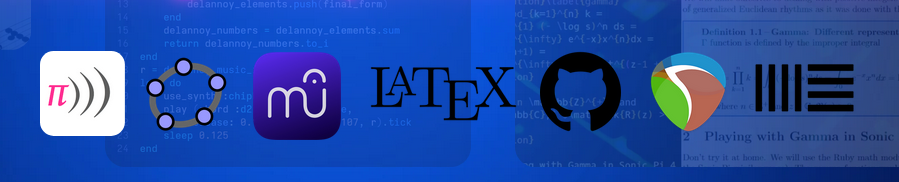

# Prelude

* [X] 👋 Hi, I’m **Edgar Delgado**  :computer: + :musical_score:

1. I’m interested in algorithmic music (**live coding**) and **Mathematical Music Theory**.
2. Assist in the integration of fresh artistic concepts into your musical and computer projects. 👀

&ensp;&ensp;&ensp;&ensp;
 &ensp;&ensp;&ensp;&ensp;
 &ensp;&ensp;&ensp;&ensp;

## Projects

* [TypeScriptTonnetz](https://github.com/edelveart/TypeScriptTonnetz) : TypeScriptTonnetz is a set of functions and operations from Mathematical Music Theory (transformational approach) in Typescript. It emerged as a development branch to contribute to Miika Alonen's phenomenal ZifferJS project.
* [Sonic Pi - Edelve](https://github.com/edelveart/Sonic_Pi_Edelve) : Contains a set of ideas and code from Sonic Pi that were used in teaching basic music technology.

## Skills

   

